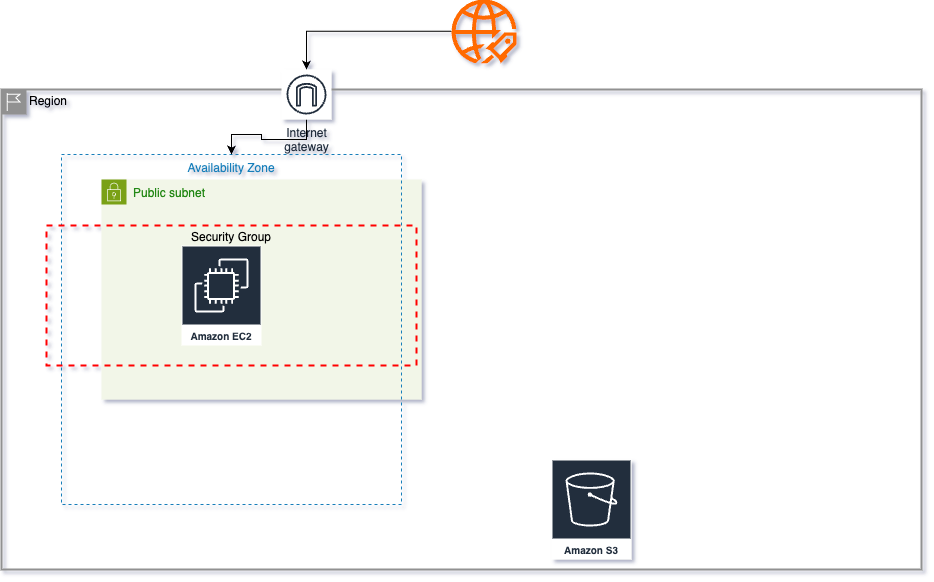

# 🚀 AWS Cloud Deployment with Terraform

## 📌 Overview
This project demonstrates how to automate AWS cloud infrastructure using Terraform.  
It provisions an **EC2 instance, S3 bucket, VPC, security group, and networking**.

## 🛠️ Technologies Used
✅ Terraform (Infrastructure as Code)  
✅ AWS EC2 (Compute)  
✅ AWS S3 (Storage)  
✅ AWS VPC (Networking)  

## 📊 AWS Architecture Diagram


## 📌 Deployment Steps
1️⃣ Clone the repository:
```bash
git clone https://github.com/YOUR_GITHUB_USERNAME/aws-terraform-deployment.git
cd aws-terraform-deployment
terraform init
terraform plan
terraform apply

terraform destroy